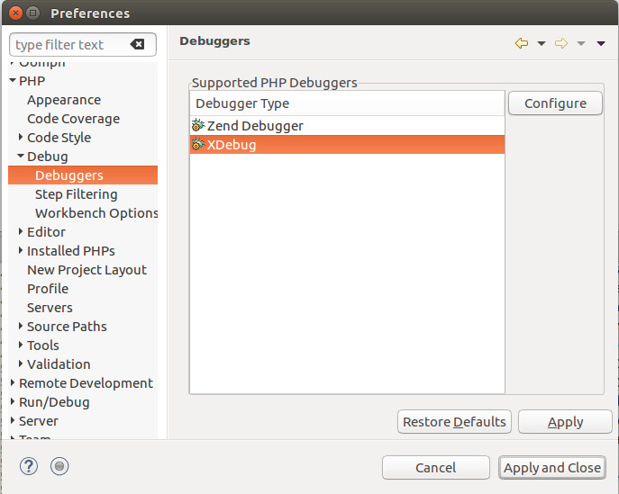
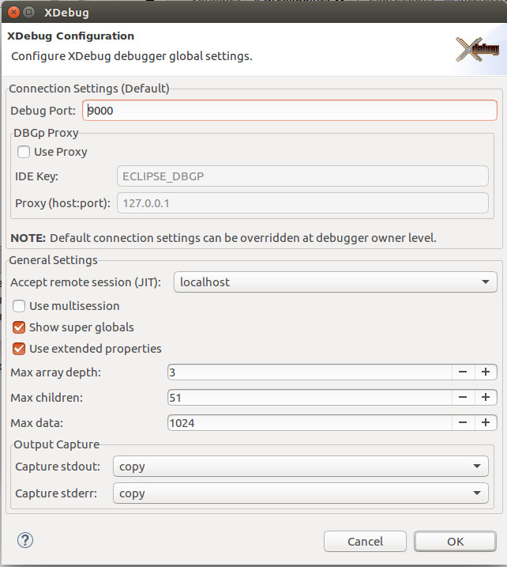
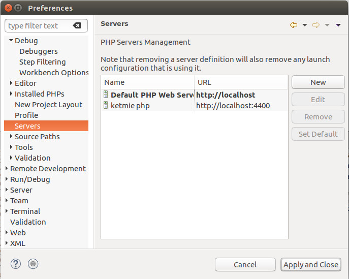
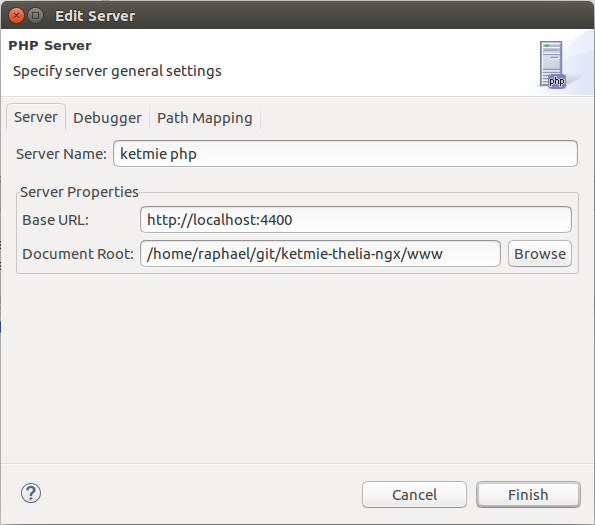
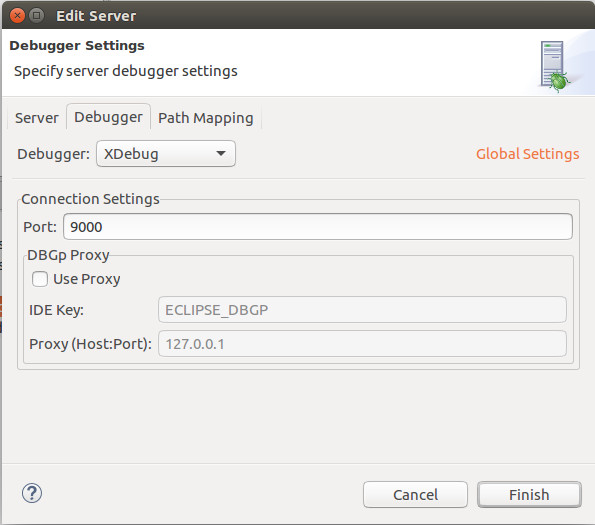
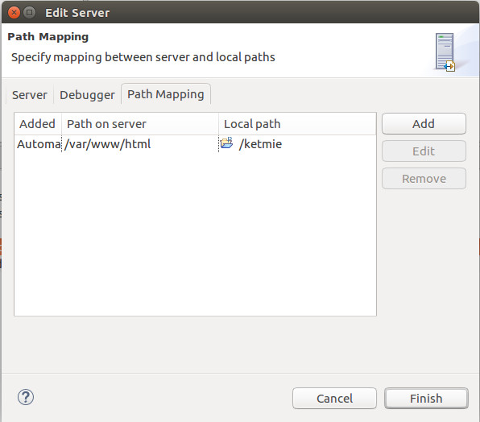
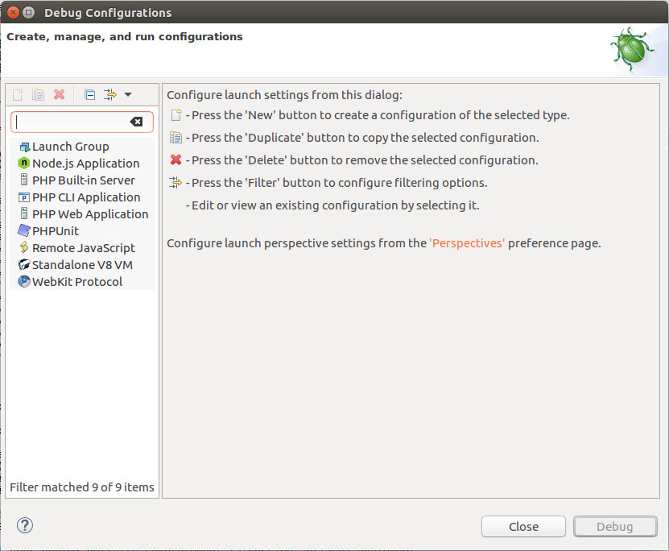
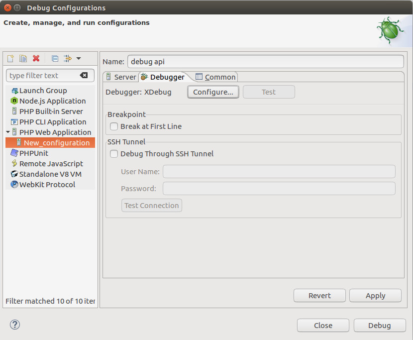

# Ketmie e-shop


## Docker

The `xdebug.remote_host` must be set for debug:

- with `php.ini`
    ```ini
    xdebug.remote_host=<HOST_IP>
    ```
- with `docker-compose`
    ```yml
    environment:
        XDEBUG_CONFIG: remote_host=<HOST_IP>
    ```

```bash
# Build containers
docker-compose build
# Build containers then run them
docker-compose up --build
# Run containers
docker-compose up
```

# Eclipse PDT configuration #

## xdebug ##



### Edit configuration ###



## Servers ##



### Create or edit a server ###



### Configure debugger ###



### Configure path mapping ###



## Debbug configurations



### Create a new `PHP Web Application` launch configuration


### Disable `Break at first line` option


# PHPUnit

Launch debugger from eclipse.

Open a terminal in the `ketmie_php7` container:

```bash
docker exec -it ketmie_php7 bash
```

Run PHPUnit:
```bash
# Single test
phpunit --bootstrap specs/autoload.php specs/tests/PDOTest.php
# Test suite
phpunit -c specs/suite.xml
# Live test suite reload
cd /shared/
./phpunit.watch.sh
```
```bash
watch-phpunit [-c <config> | -b <bootstrap> -f <file>] [-w <dir-or-file-to-watch> default:/var/www/html]
    # Examples
    watch-phpunit -b autoload.php -f specs/tests/MyTest.php
    watch-phpunit -c suite.xml
    watch-phpunit -c suite.xml -w index.php
    watch-phpunit -c suite.xml -w specs/tests
```
## Usefull commands

Get host IP address

```bash
hostname -I | awk '{print $1}'
```

Stop all running containers :

```bash
docker stop $(docker ps -a -q)
```

Open a terminal in a container

```bash
docker exec -it <container-name|container_ID> bash
```

docker tag apache2php7xdebugphpunit_app localhost:5000/data/apache2_php7_xdebug_phpunit:latest

docker push localhost:5000/apache2_php7_xdebug_phpunit:latest


Tag the image to be pushed by appending registry to the image name

$ docker images
REPOSITORY                                          TAG                 IMAGE ID            CREATED               SIZE
contrail-controller                                 4.0.0.0-3011        8bd79c6e879a        7 hours ago           1.385 GB

$ docker tag contrail-controller:4.0.0.0-3011 10.84.34.155:5000/contrail-controller:4.0.0.0-3011

push the image to the registry

$ docker push 10.84.34.155:5000/contrail-controller:4.0.0.0-3011


Successfully tagged apache2php7xdebugphpunit_apache-php7-xdebug-phpunit:latest

REPOSITORY                                            TAG                 
apache2php7xdebugphpunit_apache-php7-xdebug-phpunit   latest             
localhost:5000/data/apache2_php7_xdebug_phpunit       latest             


docker tag my_image $DOCKER_ID_USER/my_image


docker tag apache2php7xdebugphpunit_apache-php7-xdebug-phpunit:latest rvolt/apache2-php7-xdebug-phpunit


Successfully built 907154d4ce55
Successfully tagged apache2php7xdebugphpunit_apache-php7-xdebug-phpunit:latest
Starting apache2php7xdebugphpunit_apache-php7-xdebug-phpunit_1 ... done
Attaching to apache2php7xdebugphpunit_apache-php7-xdebug-phpunit_1

docker tag apache2php7xdebugphpunit_apache-php7-xdebug-phpunit:latest localhost:5000/rvolt/apache2-php7-xdebug-phpunit

apache2php7xdebugphpunit_apache-php7-xdebug-phpunit   latest
rvolt/apache2-php7-xdebug-phpunit                     latest
localhost:5000/data/apache2_php7_xdebug_phpunit       latest
apache2php7xdebugphpunit_7apache-xdebug-phpunit       latest


docker tag apache2php7xdebugphpunit_apache-php7-xdebug-phpunit:latest localhost:5000/rvolt/apache2-php7-xdebug-phpunit
docker push localhost:5000/rvolt/apache2-php7-xdebug-phpunit


docker tag apache2php7xdebugphpunit_apache-php7-xdebug-phpunit:latest rvolt/apache2-php7-xdebug-phpunit


docker rmi -f apache2php7xdebugphpunit_server rvolt/apache2-php7-xdebug-phpunit


https://registry.hub.docker.com/u/rvolt/apache2-php7-xdebug-phpunit/trigger/e15002f9-650f-4c0d-9a97-2f62884c80e8/


curl --data build=true -X POST https://registry.hub.docker.com/u/rvolt/apache2-php7-xdebug-phpunit/trigger/e15002f9-650f-4c0d-9a97-2f62884c80e8/