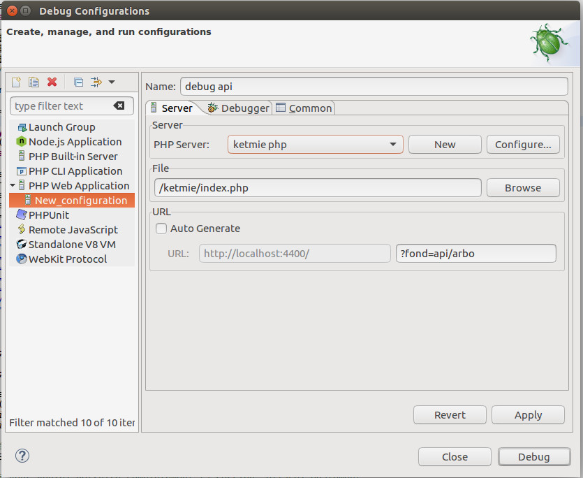

# Ketmie e-shop


## Docker

```bash
# Build containers
docker-compose build
# Build containers then run them
docker-compose up --build
# Run containers
docker-compose up
```

### Usefull commands

Stop all running containers :

```bash
docker stop $(docker ps -a -q)
```

Open a terminal in a container

```bash
docker exec -it <container-name|container_ID> bash
```

# Eclipse PDT configuration #

## xdebug ##


### Edit configuration ###


## Servers ##


### Create or edit a server ###


### Configure debugger ###


### Configure path mapping ###


## Debbug configurations


### Create a new `PHP Web Application` launch configuration


### Disable `Break at first line` option


# PHPUnit

Launch debugger from eclipse.

Open a terminal in the container:

```bash
docker exec -it ketmie_php7 bash
```

Run PHPUnit:
```bash
# Single test
phpunit --bootstrap specs/autoload.php specs/tests/PDOTest.php
# Test suite
phpunit -c specs/suite.xml
# Live test suite reload
cd /shared/
./phpunit.watch.sh
```


